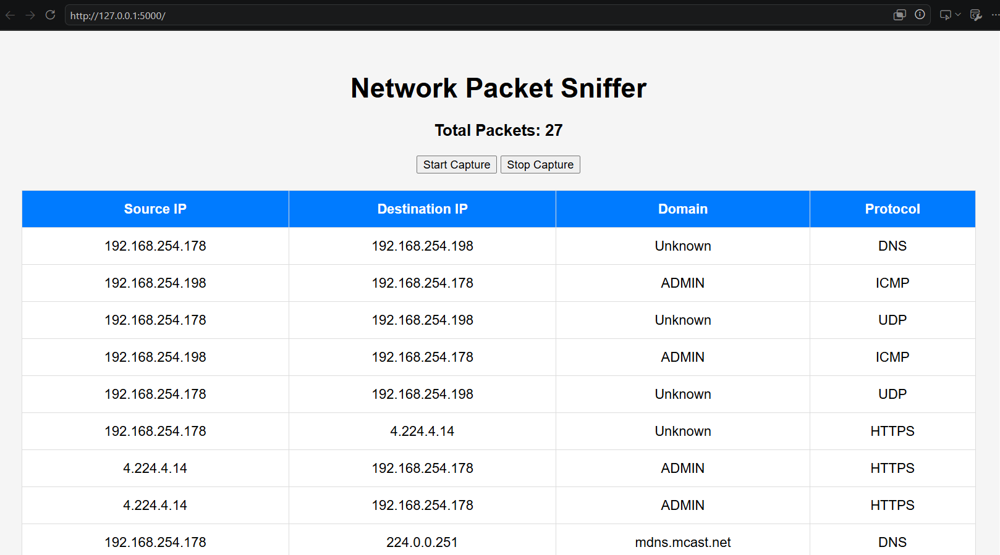

# Network Packet Sniffer Dashboard

## Overview

The Network Packet Sniffer Dashboard is a simple cybersecurity project built using Python, Flask, and Scapy. It captures network packets and displays packet information through a web-based dashboard.

## Features

* Start packet capture
* Stop packet capture
* Display Source IP Address
* Display Destination IP Address
* Identify protocols such as:

  * TCP
  * UDP
  * HTTP
  * HTTPS
  * DNS
  * ICMP
* Live packet count
* Real-time packet monitoring dashboard

## Technologies Used

* Python
* Flask
* Scapy
* HTML
* CSS
* JavaScript

## Project Structure

```text
Networksniffer/
│
├── app.py
├── README.md
│
├── screenshots/
│   └── output.png
│
└── templates/
    └── index.html
```

## Installation

1. Clone the repository:

```bash
git clone <repository-url>
```

2. Install required packages:

```bash
pip install flask scapy
```

3. Run the application:

```bash
python app.py
```

4. Open your browser and visit:

```text
http://127.0.0.1:5000
```

## Screenshot



## How It Works

* Scapy captures network packets from the system.
* Flask serves the web dashboard.
* Captured packet information is displayed in a table.
* Users can start and stop packet capture using dashboard controls.

## Learning Outcomes

This project helped in understanding:

* Network packet analysis
* Packet sniffing concepts
* Flask web development
* Network protocols
* Real-time data visualization

## Author

Lavanya


